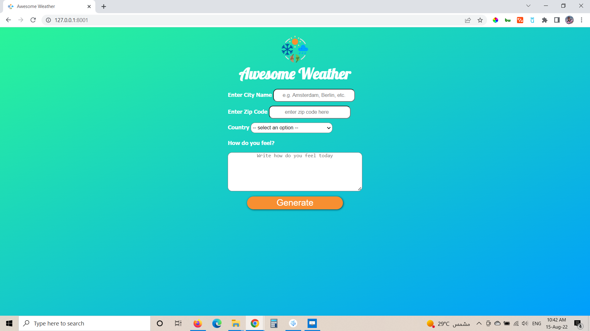
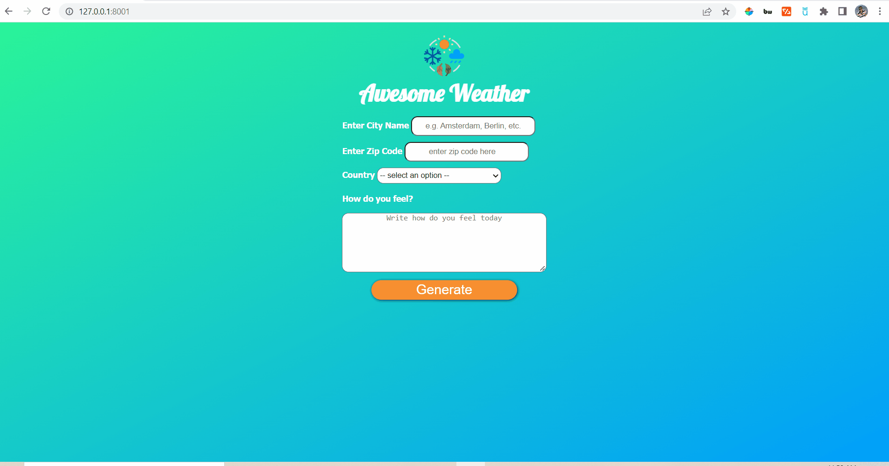
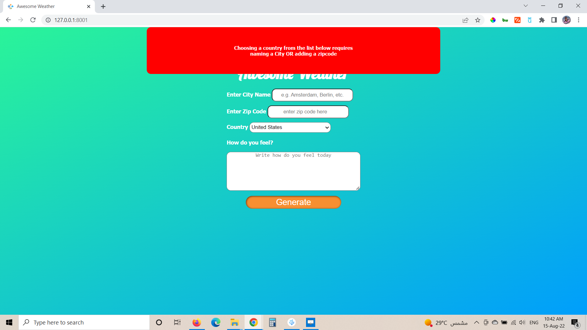
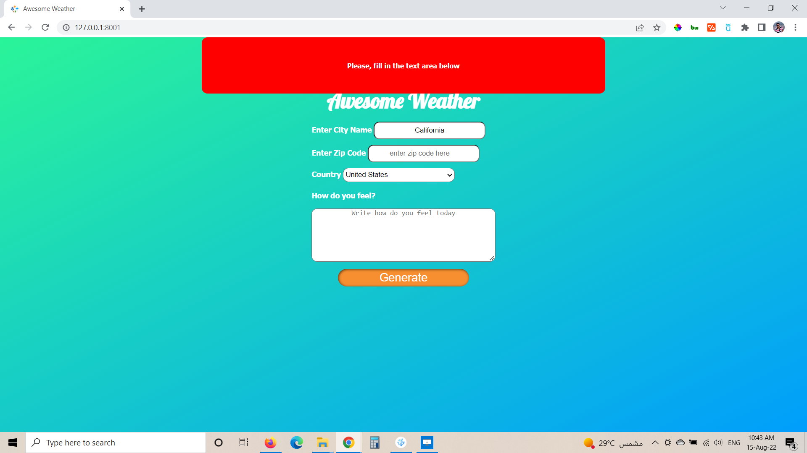
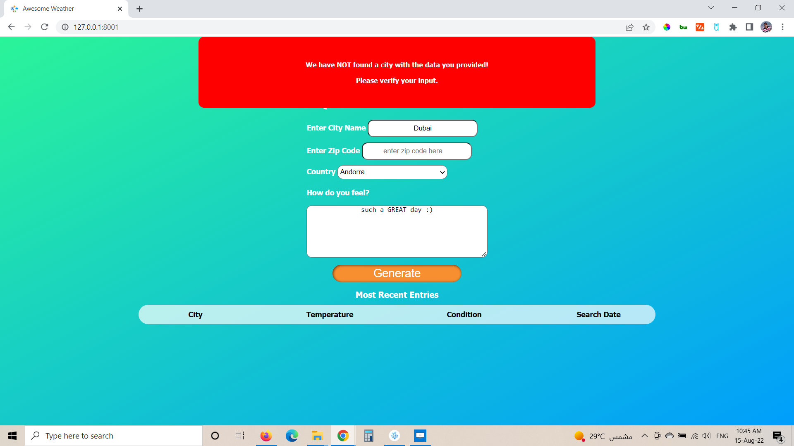
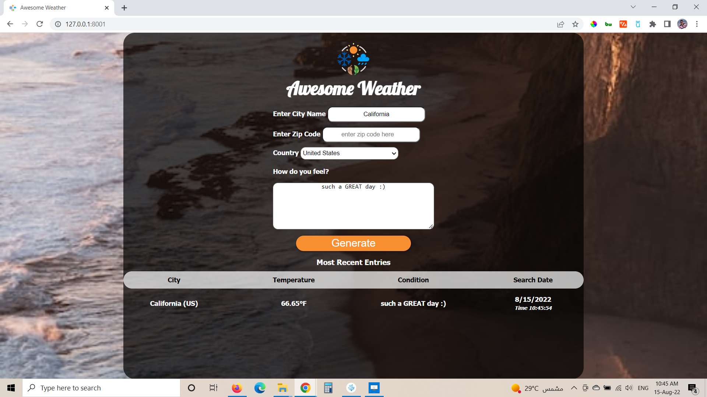
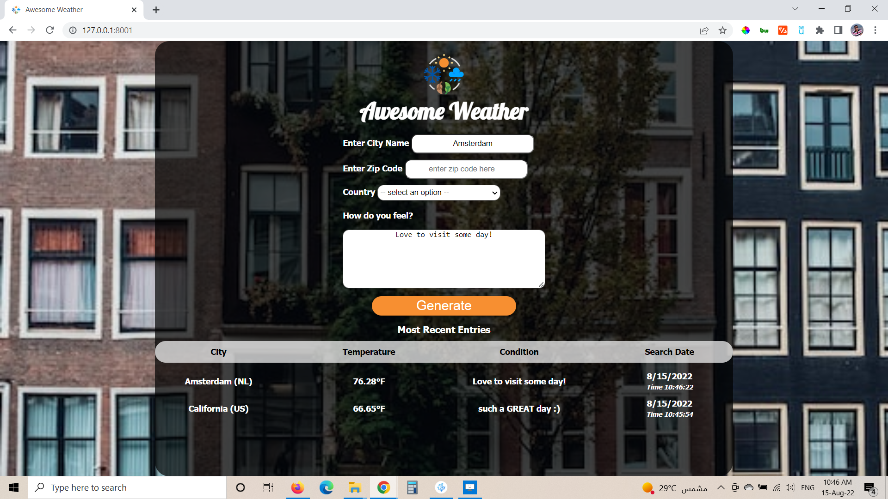
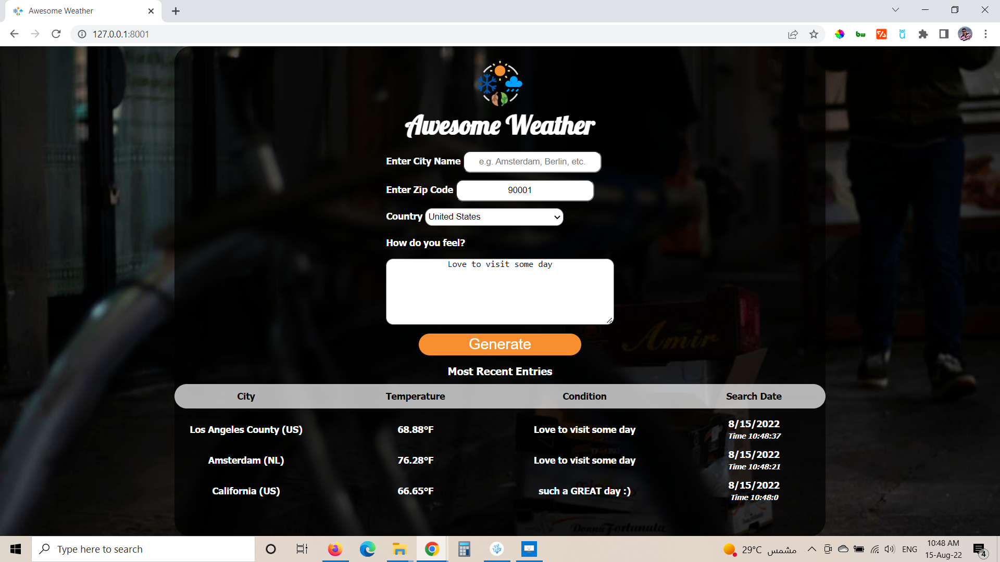

# Udacity Frontend Nanodegree - Project 2 (Weather App journal)

## sponsored and funded by [egFWD](https://egfwd.com/) 

*author*: **Ahmed E. F. R. Mohammed**

* [Features](#Features)
* [Testing](#Testing)
* [Proper-use](#Proper-use)
* [Task-Status-and-Completion](#Tasks-Status-and-Completion)

## Features

* Complete redesign of the landing page.

* **Responsive Design**: The App is adaptive to different sizes of screens.

* **User Interactivity 1**: The App background changes once the user clicks on a select item in the search history list.

* **User Interactivity 2**: Upon clicking an item in the search history list, the user gets extra weather for the day, namely **max temperature, min temperature, humidity, wind speed, and the general weather condition for the day, as provided by the API icon**.

* **Error notifications** to guide the user on how to properly use the Weather Journal App (as seen in the "Testing" section below)

## Testing

* Error resulting from the user entering a number in the City name input.

* Error resulting from the user entering a zipcode ONLY without picking a country from the dropdown list.

* Error resulting from the user choosing a country from the dropdown list, WITHOUT naming a city or entering a zipcode.

* Error resulting from the user leaving the "text area", and not entering how he feels.

* Error resulting from random entries by the user, such as naming a random city in a country.

## Proper-use

**In all the following cases, the entry in the text area is required for the app to function properly**

* The User can enter **a city name and a country** to conduct a search

* The User can enter **a city name ONLY** to conduct a search

* The User can enter **a zipcode and a country** to conduct a search

## Tasks-Status-and-Completion

| Category                  |                   Feature                         |   Condition  |     Status             |
|---------------------------|---------------------------------------------------|--------------|------------------------|
| Project Environment Setup |  Node and Express Environment                     |   required   |  :heavy_check_mark:    |
|                           |  Project Dependencies                             |   required   |  :heavy_check_mark:    |
|                           |  Local Server                                     |   required   |  :heavy_check_mark:    |
|                           |  API Credentials                                  |   required   |  :heavy_check_mark:    |
| APIs and Routes           |  APP API Endpoint                                 |   required   |  :heavy_check_mark:    |
|                           |  Integrating OpenWeatherMap API                   |   required   |  :heavy_check_mark:    |
|                           |  Return Endpoint Data (GET Route I: Server Side)  |   required   |  :heavy_check_mark:    |
|                           |  Return Endpoint Data (GET Route II: Client Side) |   required   |  :heavy_check_mark:    |
|                           |  POST Route                                       |   required   |  :heavy_check_mark:    |
| Dynamic UI                |  Naming HTML Inputs and Buttons For Interaction   |   required   |  :heavy_check_mark:    |
|                           |  Assigning Element Properties Dynamically         |   required   |  :heavy_check_mark:    |
|                           |  Event Listeners                                  |   required   |  :heavy_check_mark:    |
|                           |  Dynamically Update UI                            |   required   |  :heavy_check_mark:    |
| Student-Own initiative    |  Integrated an extra APIs (for photo search)      |   Extra      |  :heavy_check_mark:    |
|                           |  Entirely Updated The UI Design                   |   Extra      |  :heavy_check_mark:    |
|                           |  Applying Responsive Design                       |   Extra      |  :heavy_check_mark:    |
|                           |  Error Notification to Guide the User             |   Extra      |  :heavy_check_mark:    |
|                           |  App Interactivity (Image Change On User Click)   |   Extra      |  :heavy_check_mark:    |
|                           |  App Interactivity (Extra Weather Info On Click)  |   Extra      |  :heavy_check_mark:    |
